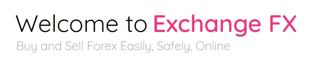

  

  <a href='https://nervous-swirles-b7c5c9.netlify.app'>View Application</a>

  

  <a href='#About'>About</a>  • 
  <a href='#API'>APIs</a>  • 
  <a href='#Features'>Features</a>  • 
  <a href='#Technologies'>Technologies</a>  •
  <a href='#To-Do'>To-Do</a>  • 
  <a href='#Resources'>Resources</a>  • 

  

# About
Exchange FX is a currency exchange project that was created as a task to incorporate different development technologies into a Web Application. At this current stage, all currency trades are hypothetical with no user balances tracked. Future updates will focus on managing currency balances in a users account. Any user that signs up automatically has two trades loaded into their trade history as an example of the functionality of the application.

# API

### Exchange Rates
<a href='https://exchangeratesapi.io/'>Exchange Rates API</a> is used to access real-time exchange rates and populate currency exchange options. 

### Country Flags
<a href='https://www.countryflags.io/'>Country Flags API</a> is used to get the flags for a specific country. 

### News API
<a href='https://gnews.io/docs/v3#introduction'>GNews API</a> is used to search for the top 10 most recent news articles that are Forex related.

# Features

### Firebase Authentication
The Web App includes firebase authentication for user login and registration. User authentication is managed using Web Tokens.

### Cloud Firestore
A users trade history is stored in a Cloud Firestore database, which is accessed when the user requests a new trade and used to populate components. 

### Trade History
Previous currency exchanges made by the user are stored in a Firebase cloud firestore database. This information is accessed and used to populate a table that shows the trade history for a user.

### New Trade
Users can request new currency exchanges, buying or selling specified currencies. As previously mentioned, the current state of the web application places no limitations on trades. Any request is processed and added to the users' history. Future updates will focus on establishing currency balances so the user will only be able to request trades if they have the required currency balances.

### Forex News
The latest and most popular forex news is available for users to view. Future updates to this page will focus on allowing user control for articles and will aim to replicate a regular news site, but with all articles focusing on foreign exchange news.

# Technologies 
* Firebase - Authentication and Cloud Firestore
* React Context-Provider - Used for sharing authentication and database state between pages and components.
* API - Used to get current exchange rates, country flags and news articles. 
* Web Tokens - Used to manage user authentication in the browser

# To-Do

### Balances
Add functionality to monitor the currency balances of a user. Trades will only be completed if the user has te necessary balances 

### News Page
* Redesign the news page so it looks like most news pages.
* Add functionality to allow the user to specify parameters for news articles such as sorting preferences or search terms.

# Resources
* <a href='https://reactcommunity.org/'>React</a>
* <a href='https://www.wattersjamesc.co.za/'>My Website</a> 
